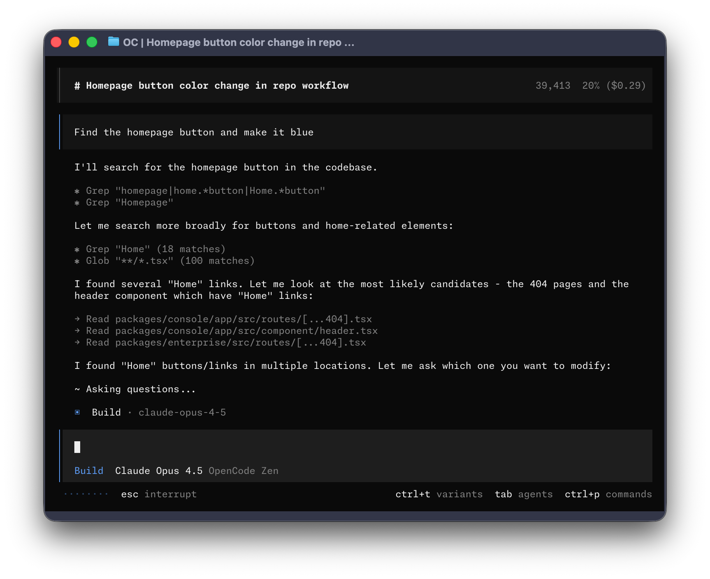

<p align="center">
  <a href="https://opencode.ai">
    <picture>
      <source srcset="packages/console/app/src/asset/logo-ornate-dark.svg" media="(prefers-color-scheme: dark)">
      <source srcset="packages/console/app/src/asset/logo-ornate-light.svg" media="(prefers-color-scheme: light)">
      
    </picture>
  </a>
</p>
<p align="center">Der Open-Source KI-Coding-Agent.</p>
<p align="center">
  <a href="https://opencode.ai/discord"></a>
  <a href="https://www.npmjs.com/package/alya-code-ai"></a>
  <a href="https://github.com/anyer097-collab/alya-code/actions/workflows/publish.yml"></a>
</p>

<p align="center">
  <a href="README.md">English</a> |
  <a href="README.zh.md">简体中文</a> |
  <a href="README.zht.md">繁體中文</a> |
  <a href="README.ko.md">한국어</a> |
  <a href="README.de.md">Deutsch</a> |
  <a href="README.es.md">Español</a> |
  <a href="README.fr.md">Français</a> |
  <a href="README.it.md">Italiano</a> |
  <a href="README.da.md">Dansk</a> |
  <a href="README.ja.md">日本語</a> |
  <a href="README.pl.md">Polski</a> |
  <a href="README.ru.md">Русский</a> |
  <a href="README.bs.md">Bosanski</a> |
  <a href="README.ar.md">العربية</a> |
  <a href="README.no.md">Norsk</a> |
  <a href="README.br.md">Português (Brasil)</a> |
  <a href="README.th.md">ไทย</a> |
  <a href="README.tr.md">Türkçe</a> |
  <a href="README.uk.md">Українська</a> |
  <a href="README.bn.md">বাংলা</a> |
  <a href="README.gr.md">Ελληνικά</a> |
  <a href="README.vi.md">Tiếng Việt</a>
</p>

[](https://opencode.ai)

---

### Installation

```bash
# YOLO
curl -fsSL https://opencode.ai/install | bash

# Paketmanager
npm i -g alya-code-ai@latest        # oder bun/pnpm/yarn
scoop install alya-code             # Windows
choco install alya-code             # Windows
brew install anomalyco/tap/alya-code # macOS und Linux (empfohlen, immer aktuell)
brew install alya-code              # macOS und Linux (offizielle Brew-Formula, seltener aktualisiert)
sudo pacman -S alya-code            # Arch Linux (Stable)
paru -S alya-code-bin               # Arch Linux (Latest from AUR)
mise use -g alya-code               # jedes Betriebssystem
nix run nixpkgs#alya-code           # oder github:anomalyco/alya-code für den neuesten dev-Branch
```

> [!TIP]
> Entferne Versionen älter als 0.1.x vor der Installation.

### Desktop-App (BETA)

Alya Code ist auch als Desktop-Anwendung verfügbar. Lade sie direkt von der [Releases-Seite](https://github.com/anyer097-collab/alya-code/releases) oder [alya-code.ai/download](https://opencode.ai/download) herunter.

| Plattform             | Download                           |
| --------------------- | ---------------------------------- |
| macOS (Apple Silicon) | `alya-code-desktop-mac-arm64.dmg`   |
| macOS (Intel)         | `alya-code-desktop-mac-x64.dmg`     |
| Windows               | `alya-code-desktop-windows-x64.exe` |
| Linux                 | `.deb`, `.rpm` oder AppImage       |

```bash
# macOS (Homebrew)
brew install --cask alya-code-desktop
# Windows (Scoop)
scoop bucket add extras; scoop install extras/alya-code-desktop
```

#### Installationsverzeichnis

Das Installationsskript beachtet die folgende Prioritätsreihenfolge für den Installationspfad:

1. `$ALYA_CODE_INSTALL_DIR` - Benutzerdefiniertes Installationsverzeichnis
2. `$XDG_BIN_DIR` - XDG Base Directory Specification-konformer Pfad
3. `$HOME/bin` - Standard-Binärverzeichnis des Users (falls vorhanden oder erstellbar)
4. `$HOME/.alya-code/bin` - Standard-Fallback

```bash
# Beispiele
ALYA_CODE_INSTALL_DIR=/usr/local/bin curl -fsSL https://opencode.ai/install | bash
XDG_BIN_DIR=$HOME/.local/bin curl -fsSL https://opencode.ai/install | bash
```

### Agents

Alya Code enthält zwei eingebaute Agents, zwischen denen du mit der `Tab`-Taste wechseln kannst.

- **build** - Standard-Agent mit vollem Zugriff für Entwicklungsarbeit
- **plan** - Nur-Lese-Agent für Analyse und Code-Exploration
  - Verweigert Datei-Edits standardmäßig
  - Fragt vor dem Ausführen von bash-Befehlen nach
  - Ideal zum Erkunden unbekannter Codebases oder zum Planen von Änderungen

Außerdem ist ein **general**-Subagent für komplexe Suchen und mehrstufige Aufgaben enthalten.
Dieser wird intern genutzt und kann in Nachrichten mit `@general` aufgerufen werden.

Mehr dazu unter [Agents](https://opencode.ai/docs/agents).

### Dokumentation

Mehr Infos zur Konfiguration von Alya Code findest du in unseren [**Docs**](https://opencode.ai/docs).

### Beitragen

Wenn du zu Alya Code beitragen möchtest, lies bitte unsere [Contributing Docs](./CONTRIBUTING.md), bevor du einen Pull Request einreichst.

### Auf Alya Code aufbauen

Wenn du an einem Projekt arbeitest, das mit Alya Code zusammenhängt und "alya-code" als Teil seines Namens verwendet (z.B. "alya-code-dashboard" oder "alya-code-mobile"), füge bitte einen Hinweis in deine README ein, dass es nicht vom Alya Code-Team gebaut wird und nicht in irgendeiner Weise mit uns verbunden ist.

---

**Tritt unserer Community bei** [Discord](https://discord.gg/alya-code) | [X.com](https://x.com/alya-code)
