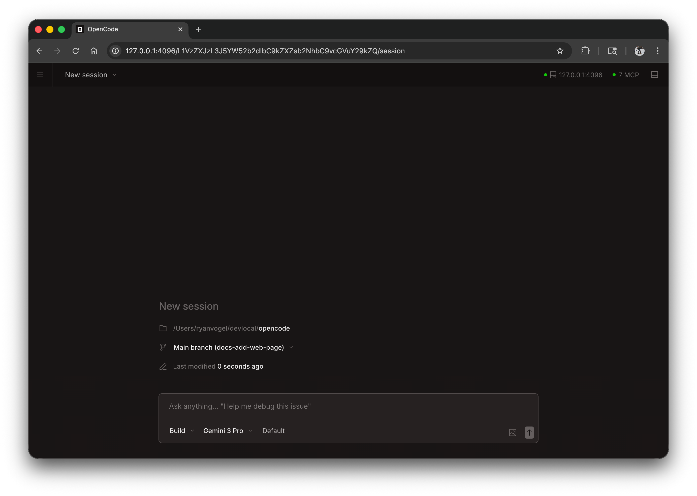

alya-code może działać jako aplikacja internetowa w przeglądarce, zapewniając takie same możliwości kodowania AI bez konieczności korzystania z terminala.



## Pierwsze kroki

Uruchom interfejs sieciowy, uruchamiając:

```bash
alya-code web
```

Spowoduje to uruchomienie lokalnego serwera na `127.0.0.1` z losowo dostępnym portem i automatyczne otwarcie alya-code w domyślnej przeglądarce.

:::caution
Jeśli `ALYA_CODE_SERVER_PASSWORD` nie jest ustawione, serwer będzie niezabezpieczony. Jest to dobre rozwiązanie do użytku lokalnego, ale powinno być ustawione na dostęp do sieci.
:::

:::tip[Windows Users]
Aby uzyskać najlepsze wyniki, uruchom `alya-code web` z [WSL](/docs/windows-wsl) zamiast programu PowerShell. Zapewnia to prawidłowy dostęp do systemu plików i integrację terminala.
:::

---

## Konfiguracja

Możesz skonfigurować serwer WWW za pomocą flag wiersza poleceń lub w [pliku konfiguracyjnym] (./config).

### Port

Domyślnie alya-code wybiera dostępny port. Możesz określić port:

```bash
alya-code web --port 4096
```

### Nazwa hosta

Domyślnie serwer łączy się z `127.0.0.1` (tylko localhost). Aby udostępnić alya-code w swojej sieci:

```bash
alya-code web --hostname 0.0.0.0
```

Podczas korzystania z `0.0.0.0` alya-code wyświetli zarówno adresy lokalne, jak i sieciowe:

```
  Local access:       http://localhost:4096
  Network access:     http://192.168.1.100:4096
```

### Wykrywanie mDNS

Włącz mDNS, aby Twój serwer był wykrywalny w sieci lokalnej:

```bash
alya-code web --mdns
```

To automatycznie ustawia nazwę hosta na `0.0.0.0` i anonsuje serwer jako `alya-code.local`.

Możesz dostosować nazwę domeny mDNS, aby uruchamiała wiele instancji w tej samej sieci:

```bash
alya-code web --mdns --mdns-domain myproject.local
```

### CORS

Aby zezwolić na dodatkowe domeny dla CORS (przydatne w przypadku niestandardowych interfejsów):

```bash
alya-code web --cors https://example.com
```

### Uwierzytelnianie

Aby chronić dostęp, ustaw hasło za pomocą zmiennej środowiskowej `ALYA_CODE_SERVER_PASSWORD`:

```bash
ALYA_CODE_SERVER_PASSWORD=secret alya-code web
```

Domyślna nazwa użytkownika to `alya-code`, ale można ją zmienić za pomocą `ALYA_CODE_SERVER_USERNAME`.

---

## Korzystanie z interfejsu internetowego

Po uruchomieniu interfejs sieciowy zapewnia dostęp do sesji alya-code.

### Sesje

Przeglądaj sesje i zarządzaj nimi ze strony głównej. Możesz zobaczyć aktywne sesje i rozpocząć nowe.


### Stan serwera

Kliknij „Zobacz serwery”, aby wyświetlić podłączone serwery i ich status.


---

## Podłączanie terminala

Możesz podłączyć terminal TUI do działającego serwera WWW:

```bash
# Start the web server
alya-code web --port 4096

# In another terminal, attach the TUI
alya-code attach http://localhost:4096
```

Umożliwia to jednoczesne korzystanie z interfejsu sieciowego i terminala, współdzieląc te same sesje i stan.

---

## Plik konfiguracyjny

Możesz także skonfigurować ustawienia serwera w pliku konfiguracyjnym `alya-code.json`:

```json
{
  "server": {
    "port": 4096,
    "hostname": "0.0.0.0",
    "mdns": true,
    "cors": ["https://example.com"]
  }
}
```

Flagi wiersza poleceń mają pierwszeństwo przed ustawieniami pliku konfiguracyjnego.
